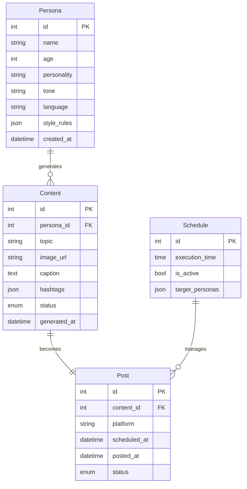
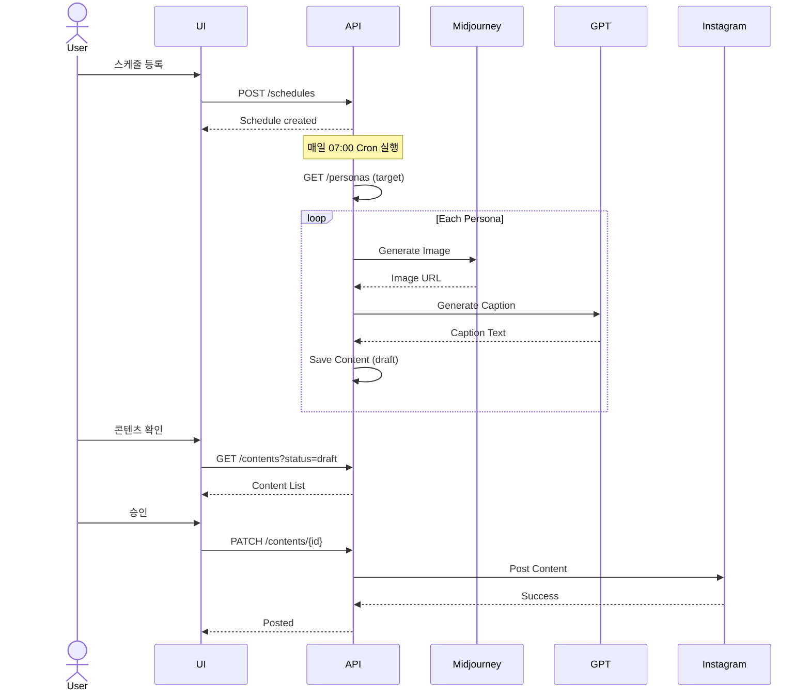

# appkit.design

**개발 준비 - API, ERD, 기술 스펙 설계**

---

## Overview

**This is Step 7 of the logical thinking 7-step workflow**:

```
논리적 사고 7단계:
1. /appkit.new      → 아이디어 스케치 (어떤 서비스인지?)
2. /appkit.spec     → 기능 구체화 (뭐가 필요할까? 누가 쓸까?)
3. /appkit.customer → 고객 스토리 (고객의 하루, 고민, 해결)
4. /appkit.sales    → 세일즈 랜딩 구성 (어떻게 설득할까?)
5. /appkit.mvp      → MVP 범위 정하기 (최소한으로 검증하려면?)
6. /appkit.merge    → 기획 정돈 (흩어진 기획 통합)
7. /appkit.design   → 개발 준비 (API, ERD, 기술 스펙) ← YOU ARE HERE
```

## Purpose

merge에서 정돈된 기획을 기반으로, 실제 개발에 필요한 **기술 스펙**을 생성합니다.
기획 레벨(merge)과 구현 레벨(개발) 사이의 다리 역할을 합니다.

**핵심 질문**: "개발자에게 뭘 전달해야 하나? 어떻게 만들까?"

---

## When to Use

- `/appkit.merge`로 기획을 정돈한 후 (Step 6 완료 후)
- 개발 시작 직전
- 기술 스펙이 필요할 때
- ERD, API 설계가 필요할 때

---

## Usage

```bash
/appkit.design
/appkit.design "persona 도메인 집중"
/appkit.design "API 우선"
```

---

## What I'll Do

### 1. 소스 문서 읽기

**읽을 파일들**:
- `docs/appkit/merge/concept-map.md` (통합 컨셉)
- `docs/appkit/merge/consolidated-specs.md` (통합 스펙)
- `docs/appkit/merge/journey-feature-map.md` (기능 매핑)
- `docs/appkit/mvp-scope.md` (MVP 범위)

### 2. 데이터 엔티티 설계 (ERD)

**Output**: `docs/appkit/design/entities.md`

```markdown
# Data Entity Design (ERD)

*생성 기준: concept-map.md, consolidated-specs.md*
*생성일: 2025-11-20*

---

## Entity Relationship Diagram


```

---

## Entity Details

### Entity: Persona

**Purpose**: 캐릭터별 페르소나 정보 저장

**Table Name**: `personas`

**Fields**:

| Field | Type | Constraints | Description |
|-------|------|-------------|-------------|
| id | INT | PK, AUTO_INCREMENT | 페르소나 고유 ID |
| name | VARCHAR(100) | NOT NULL | 캐릭터 이름 |
| age | INT | NOT NULL | 캐릭터 나이 |
| personality | TEXT | NOT NULL | 성격 설명 |
| tone | VARCHAR(50) | NOT NULL | 말투 (밝은/전문가/친근한) |
| language | VARCHAR(10) | NOT NULL | 언어 (ko/en/ja) |
| style_rules | JSON | NULL | 스타일 규칙 (이모티콘, 반말/존댓말) |
| created_at | DATETIME | NOT NULL, DEFAULT NOW() | 생성 시간 |

**Relationships**:
- `Persona.id` → `Content.persona_id` (1:N)

**Business Rules**:
- 한 페르소나는 여러 콘텐츠 생성 가능
- 페르소나 삭제 시 생성된 콘텐츠는 보존 (FK: RESTRICT)

**Sample Data**:
```json
{
  "id": 1,
  "name": "밝은 20대 여성",
  "age": 25,
  "personality": "긍정적이고 친근한 성격",
  "tone": "밝은",
  "language": "ko",
  "style_rules": {
    "emoji_frequency": "high",
    "formality": "casual",
    "hashtag_style": "trendy"
  },
  "created_at": "2025-01-01T10:00:00Z"
}
```

---

### Entity: Content

**Purpose**: AI가 생성한 콘텐츠 저장

**Table Name**: `contents`

**Fields**:

| Field | Type | Constraints | Description |
|-------|------|-------------|-------------|
| id | INT | PK, AUTO_INCREMENT | 콘텐츠 고유 ID |
| persona_id | INT | FK → personas.id, NOT NULL | 생성한 페르소나 |
| topic | VARCHAR(200) | NOT NULL | 주제 |
| image_url | VARCHAR(500) | NOT NULL | 이미지 URL (Midjourney) |
| caption | TEXT | NOT NULL | 캡션 (GPT 생성) |
| hashtags | JSON | NULL | 해시태그 배열 |
| status | ENUM | NOT NULL | draft, approved, posted |
| generated_at | DATETIME | NOT NULL, DEFAULT NOW() | 생성 시간 |

**Enums**:
- `status`: `draft` (생성됨), `approved` (검토 완료), `posted` (포스팅됨)

**Relationships**:
- `Content.persona_id` → `Persona.id` (N:1)
- `Content.id` → `Post.content_id` (1:1)

**Business Rules**:
- 하나의 콘텐츠는 하나의 포스트로 변환
- 캡션 길이: 최소 50자, 최대 2200자 (Instagram 제한)

---

### Entity: Post

**Purpose**: 실제 포스팅 기록

**Table Name**: `posts`

**Fields**:

| Field | Type | Constraints | Description |
|-------|------|-------------|-------------|
| id | INT | PK, AUTO_INCREMENT | 포스트 고유 ID |
| content_id | INT | FK → contents.id, UK, NOT NULL | 연결된 콘텐츠 |
| platform | VARCHAR(50) | NOT NULL | instagram, twitter, etc |
| scheduled_at | DATETIME | NOT NULL | 예약 시간 |
| posted_at | DATETIME | NULL | 실제 포스팅 시간 |
| status | ENUM | NOT NULL | pending, posted, failed |

**Enums**:
- `status`: `pending` (대기), `posted` (완료), `failed` (실패)

**Relationships**:
- `Post.content_id` → `Content.id` (1:1)

**Business Rules**:
- 하나의 콘텐츠는 하나의 포스트
- 포스팅 실패 시 재시도 로직 필요

---

## Summary

- **Total Entities**: 4 (Persona, Content, Post, Schedule)
- **Total Relationships**: 3 (1:N, 1:1)
- **Foreign Keys**: 3

**Entity Dependencies** (구현 순서):
1. **No dependencies**: Persona, Schedule (먼저 구현)
2. **Depends on 1**: Content (needs Persona)
3. **Depends on 2**: Post (needs Content)
```

### 3. API 엔드포인트 설계

**Output**: `docs/appkit/design/apis.md`

```markdown
# API Endpoint Design

*생성 기준: entities.md, consolidated-specs.md*
*API Style: RESTful*
*Base URL: `/api/v1`*

---

## 1. Persona APIs

### 1.1 Create Persona

**Endpoint**: `POST /personas`

**Description**: 새로운 페르소나 생성

**Request Body**:
```json
{
  "name": "밝은 20대 여성",
  "age": 25,
  "personality": "긍정적이고 친근한 성격",
  "tone": "밝은",
  "language": "ko",
  "style_rules": {
    "emoji_frequency": "high",
    "formality": "casual"
  }
}
```

**Success Response** (201 Created):
```json
{
  "persona": {
    "id": 1,
    "name": "밝은 20대 여성",
    "age": 25,
    "tone": "밝은",
    "created_at": "2025-01-01T10:00:00Z"
  }
}
```

**Error Responses**:
- 400 Bad Request: Validation failed

**Related Spec**: 001-persona/spec.md
**Related Entity**: Persona

---

### 1.2 List Personas

**Endpoint**: `GET /personas`

**Description**: 모든 페르소나 조회

**Success Response** (200 OK):
```json
{
  "personas": [
    {
      "id": 1,
      "name": "밝은 20대 여성",
      "age": 25,
      "tone": "밝은"
    },
    {
      "id": 2,
      "name": "전문가 30대 남성",
      "age": 32,
      "tone": "전문가"
    }
  ],
  "total": 2
}
```

---

## 2. Content APIs

### 2.1 Generate Content

**Endpoint**: `POST /contents/generate`

**Description**: AI로 콘텐츠 자동 생성

**Request Body**:
```json
{
  "persona_id": 1,
  "topic": "오늘의 운동 루틴",
  "auto_post": false
}
```

**Success Response** (201 Created):
```json
{
  "content": {
    "id": 101,
    "persona_id": 1,
    "topic": "오늘의 운동 루틴",
    "image_url": "https://midjourney.com/...",
    "caption": "오늘도 열심히 운동했어요! 💪...",
    "hashtags": ["운동", "헬스", "루틴"],
    "status": "draft",
    "generated_at": "2025-01-01T07:00:00Z"
  }
}
```

**Business Logic**:
1. persona_id로 페르소나 정보 조회
2. Midjourney API 호출 (이미지 생성)
3. GPT API 호출 (캡션 생성, 페르소나 톤 반영)
4. 생성된 콘텐츠 DB 저장 (status: draft)
5. auto_post = true면 자동 포스팅 예약

**Error Responses**:
- 404 Not Found: Persona not found
- 502 Bad Gateway: Midjourney/GPT API 실패
- 503 Service Unavailable: API rate limit 초과

**Related Spec**: 002-content/spec.md
**Related Entity**: Content, Persona

---

### 2.2 List Contents

**Endpoint**: `GET /contents`

**Query Parameters**:
```
?persona_id=1          // Filter by persona
&status=draft          // Filter by status
&date=2025-01-01       // Filter by generation date
&limit=20
&page=1
```

**Success Response** (200 OK):
```json
{
  "contents": [
    {
      "id": 101,
      "persona_id": 1,
      "topic": "오늘의 운동 루틴",
      "image_url": "https://...",
      "status": "draft",
      "generated_at": "2025-01-01T07:00:00Z"
    }
  ],
  "pagination": {
    "total": 45,
    "page": 1,
    "limit": 20
  }
}
```

---

## 3. Schedule APIs

### 3.1 Create Schedule

**Endpoint**: `POST /schedules`

**Description**: 자동 생성 스케줄 등록

**Request Body**:
```json
{
  "execution_time": "07:00",
  "target_personas": [1, 2, 3],
  "is_active": true
}
```

**Success Response** (201 Created):
```json
{
  "schedule": {
    "id": 1,
    "execution_time": "07:00",
    "target_personas": [1, 2, 3],
    "is_active": true
  }
}
```

**Business Logic**:
- Cron job 생성 (매일 07:00 실행)
- 실행 시 target_personas의 각 페르소나로 콘텐츠 생성
- 생성 후 자동 포스팅

**Related Spec**: 003-schedule/spec.md
**Related Entity**: Schedule

---

## 4. Post APIs

### 4.1 Create Post

**Endpoint**: `POST /posts`

**Description**: 콘텐츠를 포스팅으로 예약

**Request Body**:
```json
{
  "content_id": 101,
  "platform": "instagram",
  "scheduled_at": "2025-01-01T12:00:00Z"
}
```

**Success Response** (201 Created):
```json
{
  "post": {
    "id": 201,
    "content_id": 101,
    "platform": "instagram",
    "scheduled_at": "2025-01-01T12:00:00Z",
    "status": "pending"
  }
}
```

**Business Logic**:
1. content_id로 콘텐츠 조회
2. 포스트 생성 (status: pending)
3. scheduled_at 시간에 Instagram API 호출
4. 성공 시 status = posted, 실패 시 status = failed

**Related Spec**: 003-schedule/spec.md (포스팅)
**Related Entity**: Post, Content

---

## API Summary

| Domain | Endpoints | Description |
|--------|-----------|-------------|
| Persona | 3 (create, list, update) | 페르소나 관리 |
| Content | 2 (generate, list) | 콘텐츠 생성 |
| Schedule | 2 (create, list) | 스케줄 관리 |
| Post | 2 (create, list) | 포스팅 관리 |

**Total Endpoints**: 9

---

## Error Response Format

**Standard Error Response**:
```json
{
  "error": {
    "code": "API_RATE_LIMIT",
    "message": "Midjourney API rate limit exceeded",
    "details": {
      "limit": 50,
      "current": 51,
      "reset_at": "2025-01-01T08:00:00Z"
    }
  }
}
```

**Error Codes**:
- `VALIDATION_ERROR`: 입력 검증 실패
- `API_RATE_LIMIT`: API 제한 초과
- `GENERATION_FAILED`: 콘텐츠 생성 실패
- `NOT_FOUND`: 리소스 없음
```

### 4. 기술 정책 정의

**Output**: `docs/appkit/design/tech-policies.md`

```markdown
# Technical Policies

*기술 구현 관련 정책*

---

## API Rate Limiting

### Midjourney API
- **Limit**: 시간당 50회
- **동시 처리**: 최대 3개
- **초과 시**: 429 에러, 다음 시간까지 대기
- **Queue**: FIFO 방식

### OpenAI GPT-4 API
- **Limit**: 분당 60회
- **토큰**: 일 500,000 제한
- **초과 시**: 429 에러
- **Retry**: Exponential backoff (1s, 2s, 4s)

### Instagram Graph API
- **Limit**: 하루 200개 포스트
- **시간당**: 25회
- **초과 시**: 403 에러

**구현 방안**:
- Rate Limiter 모듈 구현
- 우선순위 큐 시스템
- API 호출 로그 기록

---

## Error Handling

### 재시도 정책

**API 실패**:
- 재시도 횟수: 3회
- 방식: Exponential backoff
- 대기 시간: 1s, 2s, 4s

**생성 실패**:
- 재시도 횟수: 2회
- 방식: 즉시 재시도
- 실패 시: 에러 로그 기록, 알림

**품질 불량**:
- 판단 기준: 이미지 해상도 < 1080x1080
- 처리: 자동 재생성 (1회)

### 로깅

**로그 종류**:
- `error.log`: 모든 에러
- `api-calls.log`: API 호출 기록
- `generation.log`: 콘텐츠 생성 기록

**로그 레벨**:
- ERROR: 시스템 오류
- WARN: API 제한 근접
- INFO: 정상 실행

---

## Content Safety

### 브랜드 안전성
- 성인 콘텐츠: GPT moderation API로 자동 차단
- 폭력/혐오: 필터 적용
- 저작권: 학습 데이터 외 참조 금지

### 품질 검증
- 이미지: 최소 1080x1080
- 캡션: 최소 50자, 최대 2200자
- 해시태그: 5-30개

---

## Data Management

### 저장 위치
- 페르소나: Database (personas table)
- 콘텐츠: Database (contents table)
- 이미지: S3 (Midjourney URL 저장)
- 로그: `logs/` directory

### 백업
- DB 백업: 일 1회 (자정)
- S3 백업: 자동 (versioning)
- 로그 보존: 90일
```

### 5. 화면-API 매핑

**Output**: `docs/appkit/design/screen-api-map.md`

```markdown
# Screen to API Mapping

*UI 화면과 API 호출 매핑*

---

## Flow: 콘텐츠 자동 생성

### Screen 1: 페르소나 설정

**User Actions**:
- 페르소나 목록 조회
- 새 페르소나 생성

**API Calls**:
```
1. GET /personas
   → Returns: 페르소나 리스트

2. (On create) POST /personas
   → Returns: 생성된 페르소나
```

---

### Screen 2: 스케줄 설정

**User Actions**:
- 스케줄 등록
- 실행 시간 설정
- 대상 페르소나 선택

**API Calls**:
```
1. GET /personas
   → Returns: 선택 가능한 페르소나

2. (On save) POST /schedules
   → Returns: 생성된 스케줄
```

---

### Screen 3: 콘텐츠 확인

**User Actions**:
- 생성된 콘텐츠 조회
- 승인/거부

**API Calls**:
```
1. GET /contents?status=draft
   → Returns: Draft 콘텐츠 목록

2. (On approve) PATCH /contents/{id}
   → Body: { "status": "approved" }
   → Returns: 업데이트된 콘텐츠
```

---

## Complete Sequence Diagram


```

---

## Output Files

### 생성될 파일들:

```
docs/appkit/design/
├── entities.md           # ERD 및 데이터 모델
├── apis.md               # API 엔드포인트 설계
├── tech-policies.md      # 기술 정책
└── screen-api-map.md     # 화면-API 매핑
```

---

## Integration Points

### 다른 명령어와의 연계:

- **From `/appkit.merge`**: concept-map.md 사용
- **To 개발팀**: 설계 문서 전달
- **To `/appkit.verify`**: 설계 완성도 체크 (향후)

---

## Key Principles

### 설계 원칙:

1. **Planning only, no code**: 설계 문서만 생성, 코드 작성 안 함
2. **Entity-first approach**: 데이터 모델부터 설계
3. **API follows entity**: API는 엔티티 관계에서 도출
4. **Traceability**: 모든 설계는 spec과 연결

---

## Next Steps

### 이 명령어 실행 후:

**📍 7단계 완료!**
- 기획부터 설계까지 모든 문서 완성
- 개발팀에게 전달 가능
- MVP Phase 0 개발 시작

---

## Version

- **Version**: 1.0.0
- **Created**: 2025-11-20
- **Philosophy**: "설계는 기획과 구현 사이의 다리"
